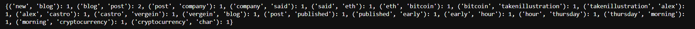
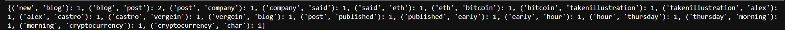
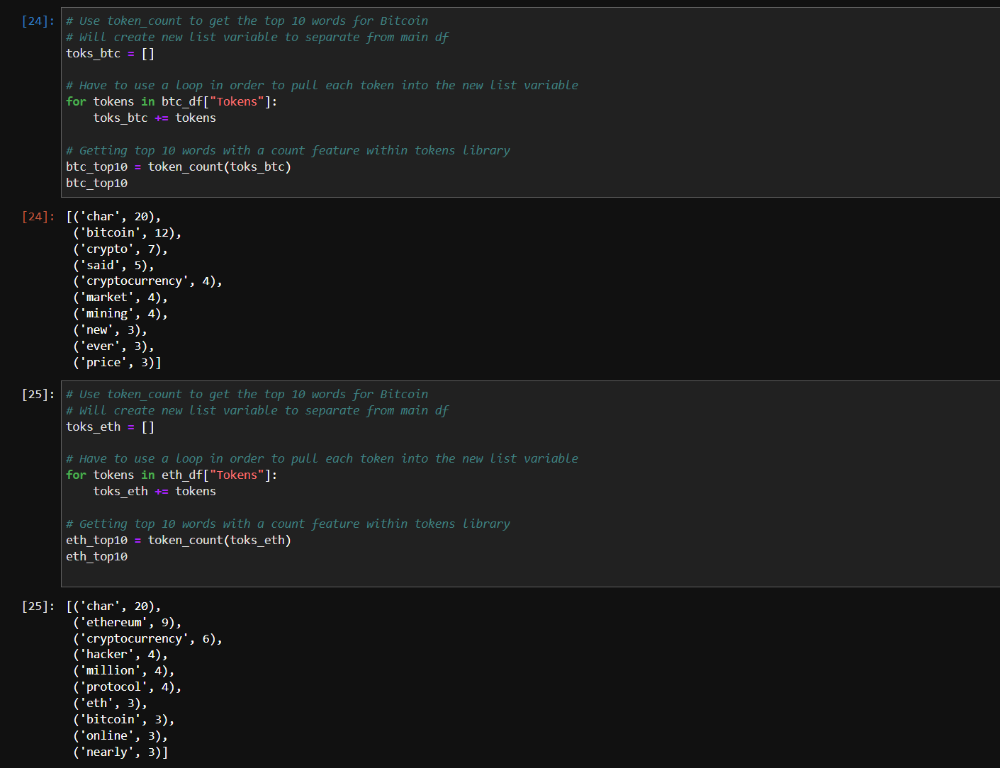
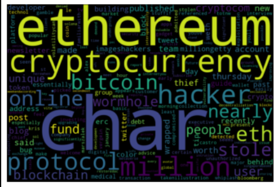
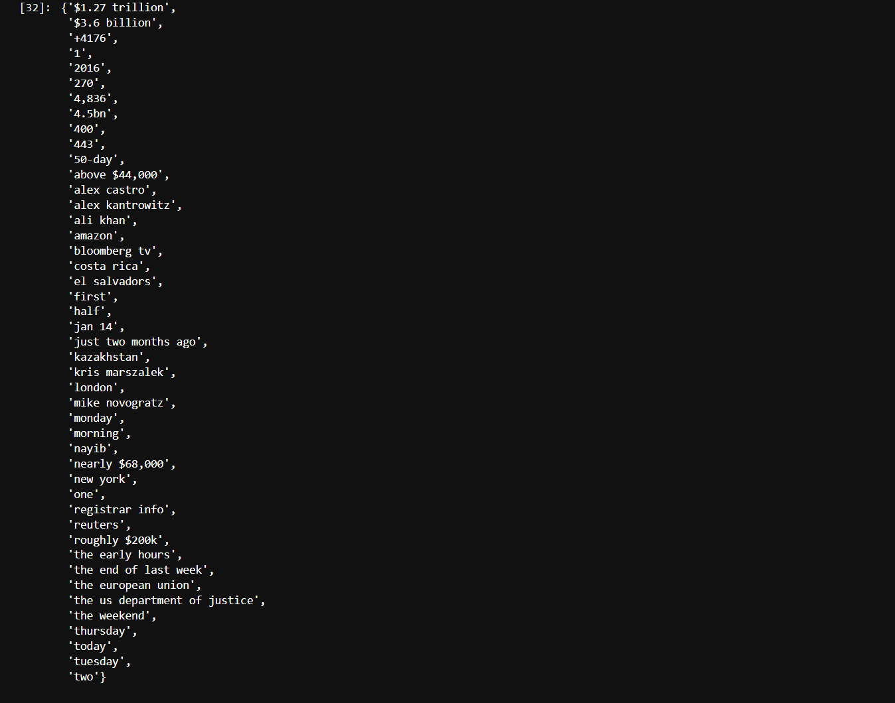

# Tales from the Crypto 
Summary
---

# Goal
The goal of this analysis tool was to apply natural language processing to understand the sentiment in the latest news articles featuring Bitcoin and Ethereum. Was also to apply fundamental NLP techniques to better understand the other factors involved with the coin prices such as common words and phrases and organizations and entities mentioned in the articles. Each Step will be summarised with the outcome below:

---

# 1 Sentiment Analysis 

**Q: Which coin had the highest mean positive score?**

A: The Sentiment analysis shows us that Ethereum had the higher mean positive score with 0.069350 to BTC 0.058750

**Q: Which coin had the highest compound score?**

A: The Sentiment analysis shows us that Bitcoin has the highest compound score with 0.680800 to ETH 0.670500

**Q. Which coin had the highest positive score?**

A: The Sentiment analysis shows us that Ethereum had the highest positive score with 0.215000 to BTC 0.148000

---

# 2 Natural Language Processing
- ## Ngrams 

- ## Token Count

- ## Word Clouds

---
# 3 Named Entity Recognition 

